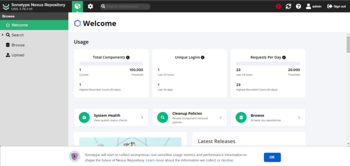

# Blogging Application CI/CD Pipeline

## Introduction
This project implements a blogging application with a CI/CD pipeline on Jenkins. It uses SonarQube to scan the source code, Trivy to scan Docker images, Maven to build the application and create a JAR file, and Nexus repository to store the JAR file. The project also includes building a Docker image, pushing it to Docker Hub, deploying to AWS EKS using Terraform, and monitoring the application with Prometheus and Grafana.

## Technologies Used
- **Jenkins**: For implementing the CI/CD pipeline.
- **SonarQube**: For scanning the source code.
- **Trivy**: For scanning Docker images.
- **Maven**: For building the application and creating JAR files.
- **Nexus Repository**: For storing JAR files.
- **Docker**: For building and managing Docker images.
- **Terraform**: For creating the AWS EKS cluster.
- **Prometheus & Grafana**: For monitoring the application.


<div align="center">
  
  </a>
</div>
<br />
<div align="center">
  
</div>


### **CI/CD Pipeline in Jenkins**


**Configure CI/CD Pipeline in Jenkins:**

```groovy
pipeline {
    agent any
    
    tools {
        jdk 'jdk17'
        maven 'maven3'
    }
    
    environment {
        SCANNER_HOME= tool 'sonar-scanner'
    }

    stages {
        stage('Git Checkout') {
            steps {
                git branch: 'main', credentialsId: 'git-cred', url: 'https://github.com/thaihung202/Blogging-app.git'
            }
        }

        stage('Compile') {
            steps {
                sh "mvn compile"
            }
        }

        stage('Test') {
            steps {
                sh "mvn test"
            }
        }

        stage('Trivy FS Scan') {
            steps {
                sh "trivy fs --format table -o fs.html ."
            }
        }
        
        stage('SonarQube Analysis') {
            steps {
                withSonarQubeEnv('sonar-server') {
                sh '''$SCANNER_HOME/bin/sonar-scanner -Dsonar.projectName=Blogging-app -Dsonar.projectKey=Blogging-app -Dsonar.java.binaries=target '''
                }
            }
        }
        
        stage('Build') {
            steps {
                sh "mvn package"
            }
        }
        
        stage('Publish Artifacts') {
            steps {
                withMaven(globalMavenSettingsConfig: 'maven-settings', jdk: 'jdk17', maven: 'maven3', mavenSettingsConfig: '', traceability: true) {
                    sh "mvn deploy"
                }
            }
        }
        
        stage('Docker Build & Tag') {
            steps {
                script {
                withDockerRegistry(credentialsId: 'docker-cred', toolName: 'docker') {
                
                sh "docker build -t thaihung17/bloggingapp:latest ."
                }
                }
            }
        }
        
        stage('Trivy Image Scan') {
            steps {
                sh "trivy image --format table -o image.html thaihung17/bloggingapp:latest "
            }
        }
        
        stage('Docker Push Image') {
            steps {
                script {
                withDockerRegistry(credentialsId: 'docker-cred', toolName: 'docker') {
                
                sh "docker push thaihung17/bloggingapp:latest"
                }
                }
            }
        }
        
        stage('K8s-Deploy') {
            steps {
                withKubeConfig(caCertificate: '', clusterName: ' AppBlogging-cluster', contextName: '', credentialsId: 'k8s-cred', namespace: 'webapps', restrictKubeConfigAccess: false, serverUrl: 'https://857CDA67ABBA6FD30ACA7EA6E77373A3.gr7.ap-southeast-1.eks.amazonaws.com') {
                    sh "kubectl apply -f deployment-service.yml"
                    sleep 20 
                }
            }
        }
        
        stage('Verify the Deployment') {
            steps {
                withKubeConfig(caCertificate: '', clusterName: ' AppBlogging-cluster', contextName: '', credentialsId: 'k8s-cred', namespace: 'webapps', restrictKubeConfigAccess: false, serverUrl: 'https://857CDA67ABBA6FD30ACA7EA6E77373A3.gr7.ap-southeast-1.eks.amazonaws.com') {
                    sh "kubectl get pods"
                    sh "kubectl get svc" 
                }
            }
        }
        
    }
}
```
**Plugins in Jenkins:**

1 Eclipse Temurin Installer 

2 SonarQube Scanner 

3 Config File Provider

4 Kubernetes

5 Kubernetes Credentials

6 Kubernetes CLI

7 Kubernetes Client API

8 Docker Pineline

9 Docker 

10 Docker API

11 Pineline: Stage View

12 Pineline Maven Integration

13 Maven Intergration

### **SonarQube and Trivy scan for vulnerabilities**

<div align="center">
  
</div>

### **Create EKS Cluster with Terraform**

<div align="center">
  
</div>

<div align="center">
  
</div>

### **Build Application with Maven and push jar file to Nexus repository**

<div align="center">
  
</div>

### **Monitoring with prometheus and grafana**

<div align="center">
  
</div>

<div align="center">
  
</div>


